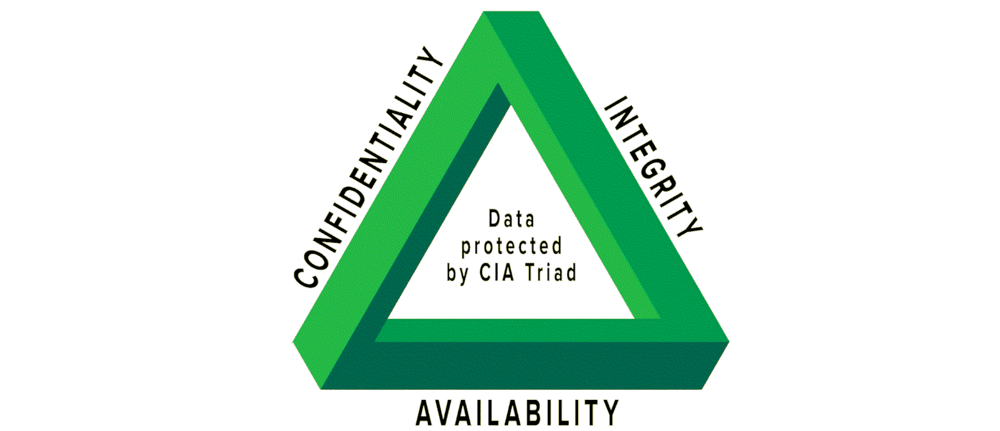

Green Team
=========================================

The green team focuses on the larger environment, both technical and human, on documenting what happens and
understanding the unseen logic of the forest, bottom-up and top-down, with intent of creating human-readable
writeups for improving communication, lowering thresholds for participation, and providing people with
well-understood choices.

These are some writeups made on our journeys in a digital landscape formed by nature's own
processes and humanoid activities and neglect throughout decades.

----

.. image:: _static/images/csoc-features.png
  :alt: SOC features

.. toctree::
   :caption: Security operations

   Alphabet soup <https://tymyrddin.github.io/green-soup/>
   Threat landscapes <https://tymyrddin.github.io/green-collect/>
   Threat intelligence <https://tymyrddin.github.io/green-intel/>

----

.. toctree::
   :caption: Threat modelling

   De-anonymisation threat model <https://tymyrddin.github.io/green-da/>
   E2EE threat model <https://tymyrddin.github.io/green-e2ee/>
   Search engine threat model <https://tymyrddin.github.io/green-se/>
   Making an application threat model <https://tymyrddin.github.io/green-app/>
   CI/CD threat model <https://tymyrddin.github.io/green-cicd/>

----

.. toctree::
   :caption: Links

   Laws of the forest <https://tymyrddin.github.io/>
   Red Team <https://tymyrddin.github.io/red/>
   Blue Team <https://tymyrddin.github.io/blue/>