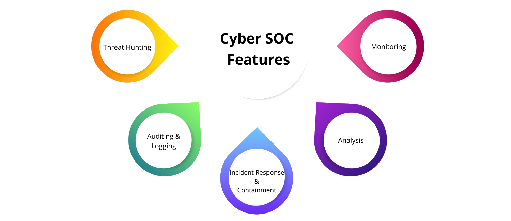

Green Team
=========================================

The green team focuses on the larger environment, both technical and human, on documenting what happens and
understanding the unseen logic of the forest, bottom-up and top-down, with intent of creating human-readable
writeups for improving communication, lowering thresholds for participation, and providing people with
well-understood choices.

The threat landscape for people in the public and private sector has changed enormously over the past decade. Physical
threats have decreased while digital security threats have increased. Meanwhile the vulnerabilities of organisations
have grown due to BYOD policies for communications, distributed teams, and public cloud-based applications being used
in normal workflows.

----

.. toctree::
   :caption: Communication

   Alphabet soup <https://tymyrddin.github.io/green-soup/>
   Security principles <https://tymyrddin.github.io/green-basis/>

----

.. toctree::
   :caption: Threat modelling

   De-anonymisation threat model <https://tymyrddin.github.io/green-da/>
   E2EE threat model <https://tymyrddin.github.io/green-e2ee/>
   Search engine threat model <https://tymyrddin.github.io/green-se/>
   Making an application threat model <https://tymyrddin.github.io/green-app/>
   CI/CD threat model <https://tymyrddin.github.io/green-cicd/>

----

.. toctree::
   :caption: Links

   Green Team: A curated collection of sessions on youtube <https://www.youtube.com/playlist?list=PLcV569XvaQtSrXdGfQnhCLMeTERDA71q2>
   Laws of the forest <https://tymyrddin.github.io/>
   Red Team <https://tymyrddin.github.io/red/>
   Blue Team <https://tymyrddin.github.io/blue/>
